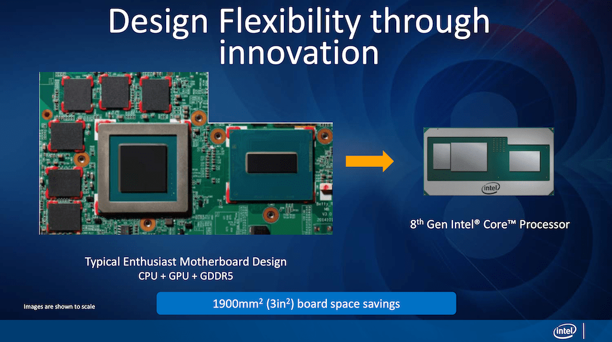
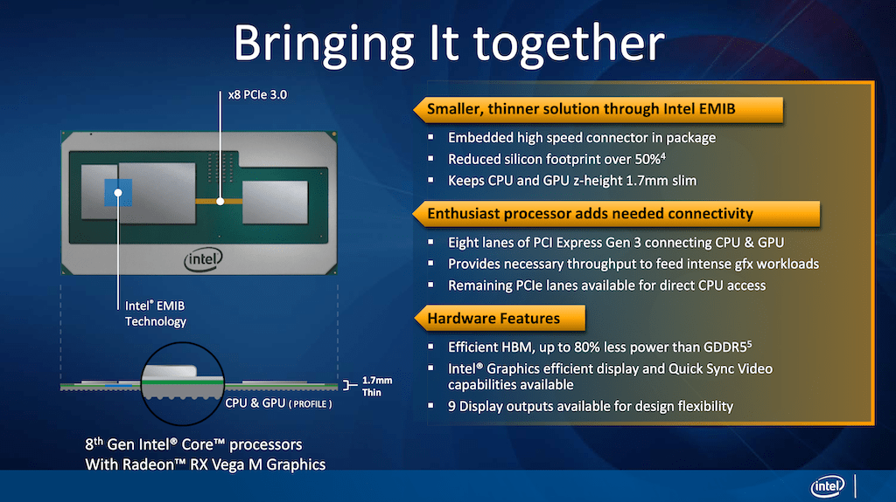
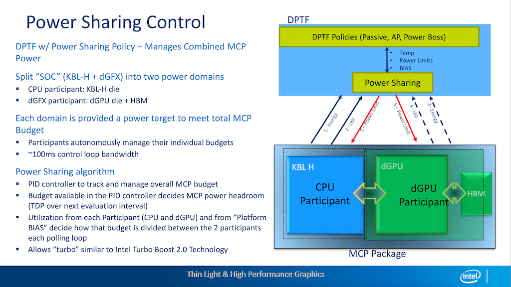
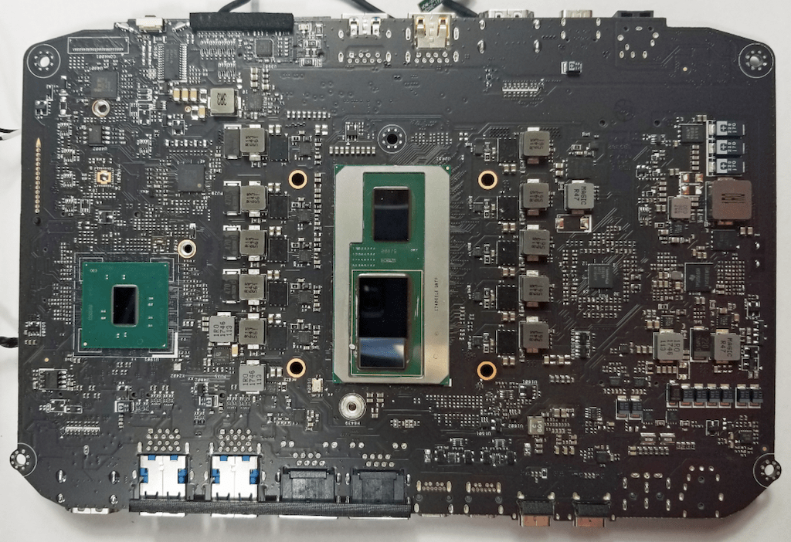
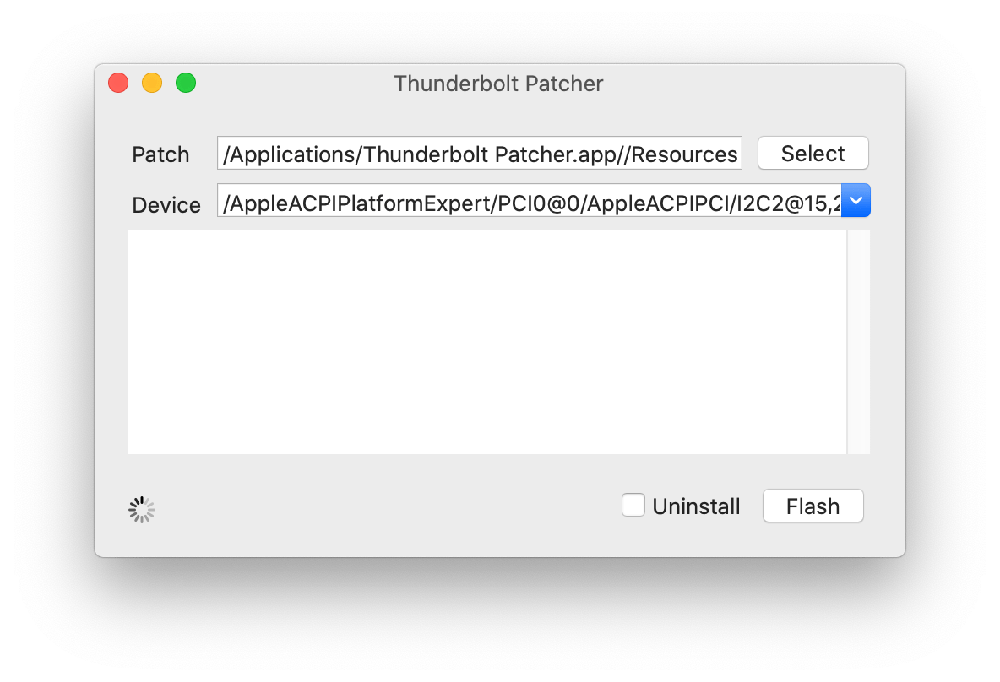
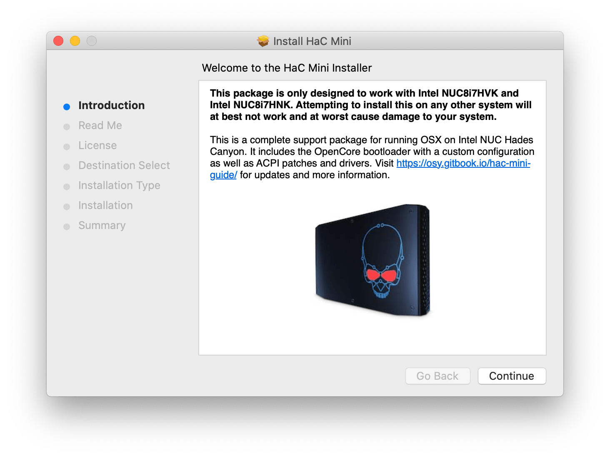

# Hades Canyon NUC

In late 2017, Intel made a surprise announcement: [they are partnering with AMD to build a Core processor paired with a Radeon GPU](https://www.pcworld.com/article/3235934/intel-and-amd-ship-a-core-chip-with-radeon-graphics.html). In hindsight, we now know that such a partnership was only possible at that time. Intel was still the leader in CPU performance and AMD's Zen+ was about to be released, causing competition to heat up and for AMD to eventually overtake Intel with Zen 3. Meanwhile, Intel was just getting started with their Xe graphics and was about to enter the race again for high end graphics. If things have gone differently, the Kaby Lake-G chip could have been the start of a whole line of Intel-AMD products, but here we are in 2021, looking back at Kaby Lake-G as a historical curiosity, as if it fell out of an alternate timeline. This retrospective will look at why the Hades Canyon NUC \(running Kaby Lake-G\) was so interesting to technology enthusiasts, how we ported macOS to it, and what its future holds.

### Designed for Apple?

Since its inception, people speculated that Apple would be the main customer for the Kaby Lake-G series. We now know that would never have come to fruition as Apple was already well underway in their transition to Apple Silicon. There were a few laptops that did use the lower end Kaby Lake-G with a smaller AMD GPU \(Vega M GL\): Dell XPS 15 9575, HP Spectre x360, Acer Aspire 7, etc. However, there were no laptops that used the full Vega M GH graphics chipset. Where these SKUs originally intended for a higher end MacBook Pro? The Mac mini? Or did Intel design them solely for the NUC Hades Canyon and the [Chuwi HiGame](https://www.chuwi.com/product/items/Chuwi-HiGame)?

### New Technology

Intel presented some details of the Kaby Lake-G chips at [HotChips 30](https://old.hotchips.org/hc30/1conf/1.04_Intel_Thin_Light_Gaming_HotChips_SC_Final.pdf). They detailed the first use of Embedded Multi-Die Interconnect Bridge \(EMIB\) on a consumer product... and amazingly that it was used to connect a Radeon GPU to its HBM \(high bandwidth memory\).

Additionally, with the close coupling of the CPU and dGPU on a single substrate, Intel was able to make more intelligent power delivery decisions, enabling more performance to the CPU or GPU when needed. \(Here in 2021, you may be aware of NVIDIA's Dynamic Boost 2.0 which is similar in functionality with NVIDIA's added marketing of "AI"\).

All this shows how unique of a product Kaby Lake-G. At a time when Intel's innovation was perceived as stagnating, Kaby Lake-G and NUC Hades Canyon quietly slipped past people's notice.

### NUC Hades Canyon

Intel's NUC series are sort of reference platforms for Intel's chips and represents the best of what Intel platforms can do. In a way, these tightly integrated designs are like those from Apple: there won't be much space unused, features disabled or neglected, and corners cut. This begs the question: just how much can we make a [NUC into a Mac](../mac-vs-hac.md)?

## HaC Mini: A History

What if Apple made a Mac mini that is just as small but has a GPU as powerful as a GTX 1060, more ports, and expandable components? That was the goal of the HaC Mini project.

### Beginnings

I haven't had much experience with Hackintoshes in the past so I started by doing a lot of reading of various Hackintosh forums, a couple of blogs, and source code of various Hackintosh projects. Quickly, I realized that much if not all the information out there is useless.

* Much of the information is outdated and irrelevant for this project. For example, many older PC systems lack EFI or boot into IDE or have older Intel processors without modern vector instructions. As a result, much of the guides have been "polluted" with troubleshooting for legacy devices.
* The Hackintosh community practices [cargo culting](https://en.wikipedia.org/wiki/Cargo_cult) and this can be seen in most "install guides" out there. As an example, an old patch floating around to recognize SATA drives on very old versions of OSX somehow is in every "example" config file. Often old fixes and workarounds are never removed even when the issue has been gone for years. As a result, you often have guides and config files filled with cryptic terminology about DSDT patching or property injections or such-and-such "fixups" without anyone explaining what they mean or why they are needed.
* A lot of the tools used for Hackintosh were severely outdated or non-existent. Many were designed in back when OSX was named after big cats and never updated.

As someone with not a lot of Apple experience but with a background in systems engineering, I decided the best way forward is to start from the ground up, ignoring the existing "guides" and "distributions" and to document my journey along the way.

### Initial Bringup

The most important thing for getting a Hackintosh working is to set up a pre-boot environment so that the macOS bootloader can be tricked into booting up on non-Apple hardware. In 2018, the only game in town was [Clover](https://sourceforge.net/projects/cloverefiboot/), a decades old bootloader that has the patching capabilities needed to boot macOS.

There are two main parts for configurating Clover to boot macOS. First, you have to enable the correct memory patches. These include, for example, patches to XNU that writes to MSR registers that are locked due to BIOS configuration on the NUC. To get macOS to boot, I started with a minimal Clover config file and progressively enabled more and more patches until macOS booted up. In this case, it didn't take many tries so most of the patches available in Clover were not useful for the Hades Canyon.

The second part is more challenging and it is ACPI patching. PC device configuration traditionally used ACPI and while this is considered legacy technology now, it is still used by macOS to enable certain features. I learned the ASL language \(for describing the ACPI device table\) as well as the AML bytecode that ASL compiles into. Then by comparing the ACPI tables from a Mac mini with the NUC Hades Canyon, along with references of various issues that are solved by ACPI patching, I was able to find the needed set of ACPI patches needed for the system to be usable.

All the Clover patches annotated with my notes are [documented here](../legacy-guide-clover/clover-settings-annotated.md).

### Fixing Devices

At this point, no new ground was broken. I have arrived at where most people running a Hades Canyon Hackintosh are already at. I have learned quite a bit about how Hackintoshes worked and the PC boot process, but I now run into the same hardware issues that people have complained about in various forum posts.

First was **audio**, the NUC Hades Canyon has two analog outputs, one digital output \(shared 3.5" jack with the back analog output\), and two internal microphones. To get macOS to recognize them, it is necessary to map out the correct codec "path." After reading Intel's HDA specifications to figure out how the audio codecs are set up, dumping the ALC700's codec devices from Linux, and seeing how [AppleALC](https://github.com/acidanthera/AppleALC) \(a Hackintosh driver that does the codec path patching\) works, I wrote and [submitted a patch to AppleALC](https://github.com/acidanthera/AppleALC/pull/429) to get all the audio devices working. The whole process is [documented in more detail here](hda-fix.md).

Next up was various issues with **USB**. The first issue was that when waking from USB \(keyboard press for example\), the screen will not turn on automatically and would require a second USB event \(another key press\) after the computer wakes up for the screen to wake up. While this is not a game-breaking bug, it does make day to day usage quite annoying. After a long journey reversing XNU code, the BIOS, and reading Intel's documentations, I discovered that modern Macs use a separate chip \(the SMC\) to handle sleep/wake events and the legacy code to handle it with ACPI \(still used on older Macs\) was imperfect. Additionally, there is a bug in Intel's BIOS which clears an indicator bit that XNU looks at to see the source of the wakeup. Because that indicator bit was cleared, macOS defaults to the assumption that it is a "dark wake" \(a non-interactive wakeup usually to fetch emails for example\). To workaround this bug, I wrote the [USBWakeFixup](https://github.com/osy/USBWakeFixup) driver to fake this wake indicator. Unfortunately, a similar Intel BIOS bug \(clearing indicator flags\) also resulted in an [unfixable issue](https://github.com/osy/HaC-Mini/issues/8) where any USB storage drive attached will be reset on wakeup.

**Wifi** and **Bluetooth** were also an issue as driver support for Intel wireless was non-existent at the time \(and fairly immature now\). However, we cheat around this by [replacing the wireless card](../post-installation/wifi.md) with one from a MacBook.

While the audio and USB issues were rather straightforward to solve, what remains are the difficult hardware problems. First are the **GPU** problems. There seems to be some issue with the Metal driver causing graphical artifacts to appear in some textures. The journey deep into reversing the Metal drivers and comparing it to Linux source and fixing the issue is [documented here](metal-driver-fix.md). Another common issue is that at certain resolutions, there seems to be a problem with VBlank timing causing [random flickering to appear](https://github.com/osy/HaC-Mini/issues/7). I was not able to find the root cause for the flickering although I suspect that the issue is with macOS drivers not setting up VBlank timings properly at low power. However, I did create a workaround to force the window server to [render at a constant framerate](https://github.com/osy/SLForceFPS).

Finally, the biggest hardware issue to solve was getting **Thunderbolt** to work. This has been a white whale in the Hackintosh community for a long time. The issue here is that how Apple uses Thunderbolt is literally different from how everybody else uses Thunderbolt. Apple manages the TB3 controller directly by the driver code while Windows and Linux tells the TB3 controller to automatically manage link events by the on-chip firmware. In fact, for compatibility, when running Boot Camp, Macs will reset the controller to use the firmware. The initial workaround I developed \(documented [here](thunderbolt-3-fix.md)\) uses the ACPI device table to fake the TB3 controller as a normal removable PCIe slot \(bypassing Apple's TB3 driver code\). This worked fine for PCIe passthrough devices but lacked support for more advanced TB3 aware devices \(such as the UltraFine 5K display\). It also broke swapping between TB3 and USB devices \(the port is "stuck" to whatever configuration it was on boot\). My second workaround \(documented [here](thunderbolt-3-fix-part-2.md)\) used a technique inspired by Macs running Boot Camp. Those Macs would use an ACPI setup function to reset the TB3 controller and force it to managed firmware mode. So I did the same thing but forced it to reset into unmanaged mode. This allowed the UltraFine 5K display to work but introduced a lot of system instabilities due to the Intel TB3 controller being extremely buggy and poorly designed. Sleep/wake was broken half the time due to spurious interrupts and sometimes the system will refuse to wakeup and have to be hard reset. In the end, I had to go all out, physically dump the TB3 controller firmware, reverse how the controller was configured, and re-flash a patched firmware \(documented [here](thunderbolt-3-fix-part-3.md)\). I also discovered a way to [patch the TB3 controller directly](https://github.com/osy86/ThunderboltPatcher) through a backdoor interface without a hardware flasher. Finally, we have working Thunderbolt on a Hackintosh! I've heard from various people that my techniques have been applied to other Hackintosh builds as well.

### OpenCore

In 2019, the first build of [OpenCore](https://github.com/acidanthera/OpenCorePkg) was released and this changed the frontier of Hackintoshes overnight. Up until this point the only way to boot OSX was through the Clover bootloader \(or one of its various derivatives or parents\). As described above, Clover's codebase is decades old and designed at a time where PCs did not use EFI. As a result, it has legacy baggage that requires it to have to be manually updated with offsets after every macOS update. Its patching mechanism was also hacked together and macOS's new kernel cache made patching KEXTs harder. The documentation was poor and many config settings and patches were outdated or so cryptic that you have to read the source code to figure out what it does. Finally, the code was buggy at times and sometimes dangerously insecure.

OpenCore was created as a UEFI application and has a [well documented specification](https://github.com/acidanthera/OpenCorePkg/blob/master/Docs/Configuration.pdf) for its configuration. It has a modern patching system and much cleaner code. In fact the group that maintains it, [Acidanthera](https://github.com/acidanthera), is composed of very talented individuals who obsess with every detail. They also maintain most of the other popular Hackintosh drivers that just about every Hackintosh build uses.

OpenCore also does not "hide the details" from the user or force a default set of patches to apply to every build. You can boot OpenCore on a real Mac, a VM running on a Mac, an AMD based PC, and any other x86 configuration with the right set of options. \(Clover, on the other hand, will fail on many less-supported configurations without lots of work\). HaC mini v2.0 was quickly released to replace Clover with OpenCore after determining the right configuration, again, by trying every knob and recording what works.

As a bonus, the combination of OpenCore, Intel BIOS/Boot Guard \(enabled on NUCs but not on much else\), and Apple's SIP made it possible to [build a truly secure Hackintosh](secure-boot.md) comparable to a Mac.

### Building an Installer

The goal of the project was not just to replicate a Mac mini, but to replicate the Apple experience. Asking users to open the Terminal, mount the EFI partition, copy some files, and modify a plist was not "Apple like." There is a portion of the Hackintosh community who believe that knowing how to do that is a "rite of passage" and would like to gate-keep users who don't have the know-how or patience to try. I believe that it is better to have a lower barrier of entry so I set out to create a simple installer for the project.

The installer is built with [Packages](http://s.sudre.free.fr/Software/Packages/about.html), which provides a simple interface for building macOS installers. I wrote a shell script to download all the drivers and resources and another script to install everything to the EFI partition. Finally, I automated everything with Github Actions so to update a driver, all I have to do is modify a .txt file with the download URL and to release a new installer, all I have to do is create a Github release.

To top things off, I added a feature that allows you to install HaC mini to a macOS installer USB which installs OpenCore to the USB as well as patches the macOS installer so when you boot the macOS installer from OpenCore on another computer with the USB, it will automatically install HaC mini as part of macOS installation. That means you can even build such a USB installer for a non-technology literate friend and they can install macOS on their NUC Hades Canyon without knowing anything about Hackintosh. \(Unfortunately, this feature was broken with the release of macOS 11 as Apple decided to be more strict about package signing.\)

### Future

I have personally been using this Hackintosh as a daily driver for the past two years. The list of remaining todos is small and likely won't ever be fixed \(by me\) because of either difficulty or lack of interest:

* Find a proper fix for the flickering display issue
* Find a workaround of the USB storage reset on wake issue
* Get external microphone on headsets working
* Fix DRM issues with Netflix, Apple TV+, etc
* Fan and LED controls

Aside from that, [just about everything is working](../#working-hardware) as you might expect from a Mac. Future updates likely will only involve driver updates from Acidanthera and OpenIntelwireless, especially as new macOS releases will inevitably break things. There is also a final sunset for Intel macOS, which, if going by the PowerPC transition, would be around 2025.

I believe that ARM Hackintoshes will be possible. [Corellium](https://corellium.com) uses a farm of Ampere Altra to power their virtualized iOS devices. The real question is if there will still be any value for Hackintosh considering the power of Apple Silicon. Hopefully there will be stronger competition in the future leading to better computers for all of us.

