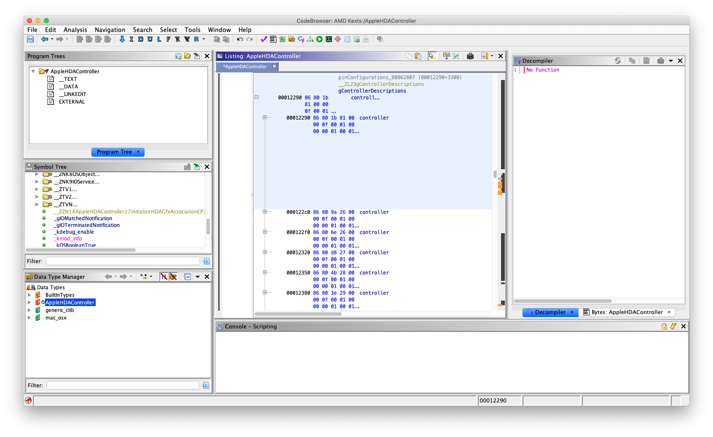
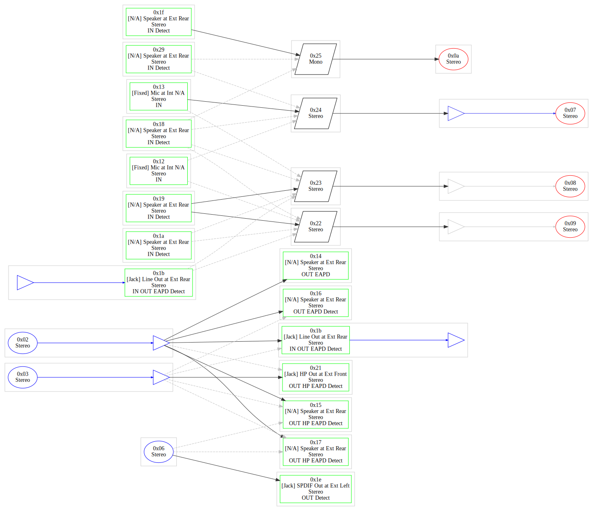

# HDA Fix

Getting audio working is one of the more tricker aspects of a Hackintosh platform bringup. Modern audio hardware consists of two parts: the HDA controller and the audio codec. The controller implements a serial interface [defined by Intel](https://www.intel.com/content/dam/www/public/us/en/documents/product-specifications/high-definition-audio-specification.pdf) and interfaces with an external codec chip designed by a number of third parties. Apple has a driver for the controller `AppleHDAController.kext` but it only recognizes a small subset of HDA controllers even though the interface is standard and mostly the same. Apple also has drivers for a small handful of codecs `AppleHDA.kext` that they support. There is a project, [AppleALC](https://github.com/acidanthera/AppleALC), which patches these drivers for compatibility with non-Apple supported controllers and codecs. However, the process to extend this for a new chipset is not well documented anywhere, so hopefully this should serve as a reference for future hackintoshers.

### HDA Controller

Patching `AppleHDAController.kext` to recognize a new controller is easy. The kext driver matches on the HDA PCI class but inside the driver code is a hard coded list of controllers that it supports.



We have two controllers on the NUC. One on the processor with the identifier `8086:A171` \(a search shows that it's common to all Kabylake H processors\) and another one with the identifier `1002:AB08` which is found on the Vega M's PCI bus.

The closest controller to the Kabylake H processor that is supported is the Skylake H one \(`8086:A170`\). For the AMD controller, the closest one is Tonga  \(`1002:AAD8`\). Even though in theory the controller interface is the same, there seems to be some specific code paths for specific controllers, likely to implement some quirks, so to be safe we try to choose a controller from the same generation \(knowing that PIDs are incremented for each new product\).

We have to choice in the actual patching. `AppleHDAController` has direct support for mapping one PID to another by modifying the Info.plist. For example, we see:

```markup
				<dict>
					<key>LayoutID</key>
					<integer>78</integer>
					<key>SourceDID</key>
					<integer>43584</integer>
					<key>StandInDID</key>
					<integer>43568</integer>
					<key>VID</key>
					<integer>4098</integer>
				</dict>
```

Which in this example maps `1002:AA40` to `1002:AA30`. Seems like Apple eventually got tired of adding to the code and just modified the Info.plist instead. However, because we are using AppleALC with its own patching system, we can leave the kext untouched and modify the Controllers.plist in AppleALC.

```markup
	<dict>
		<key>Device</key>
		<integer>43784</integer>
		<key>Model</key>
		<string>Desktop</string>
		<key>Name</key>
		<string>AMD Vega-M HDMI</string>
		<key>Patches</key>
		<array>
			<dict>
				<key>Count</key>
				<integer>2</integer>
				<key>Find</key>
				<data>AhDYqg==</data>
				<key>MinKernel</key>
				<integer>15</integer>
				<key>Name</key>
				<string>AppleHDAController</string>
				<key>Replace</key>
				<data>AhAIqw==</data>
			</dict>
			<dict>
				<key>Count</key>
				<integer>2</integer>
				<key>Find</key>
				<data>2KoAAA==</data>
				<key>MinKernel</key>
				<integer>15</integer>
				<key>Name</key>
				<string>AppleHDA</string>
				<key>Replace</key>
				<data>CKsAAA==</data>
			</dict>
		</array>
		<key>Vendor</key>
		<string>AMD</string>
	</dict>
	<dict>
		<key>Device</key>
		<integer>41329</integer>
		<key>Name</key>
		<string>Kaby Lake H PCH HD Audio</string>
		<key>Patches</key>
		<array>
			<dict>
				<key>Count</key>
				<integer>6</integer>
				<key>Find</key>
				<data>cKEAAA==</data>
				<key>MinKernel</key>
				<integer>16</integer>
				<key>Name</key>
				<string>AppleHDAController</string>
				<key>Replace</key>
				<data>caEAAA==</data>
			</dict>
			<dict>
				<key>Count</key>
				<integer>1</integer>
				<key>Find</key>
				<data>hoBwoQ==</data>
				<key>MinKernel</key>
				<integer>16</integer>
				<key>Name</key>
				<string>AppleHDAController</string>
				<key>Replace</key>
				<data>hoBxoQ==</data>
			</dict>
		</array>
		<key>Vendor</key>
		<string>Intel</string>
	</dict>
```

This does a dynamic search-and-replace in the driver binary itself to replace all instances of the source PID.

### HDA Codec

Now that the driver matches on the HDA controller, we still don't have sound. This is because we still need a driver on the codec \(imagine that you have a driver for your USB controller but not for the USB device that's connected; same idea\). HDA codecs are historically a messy endeavor. In Linux, the driver code for the codecs are some of the more messy and hacked up parts. This is because there is no standard for the codec interface but most codecs are "close enough." Linux's solution is to have a huge lookup table of patches specific to each codec.

A quick overview of how codecs works: a codec device has a number of "widgets" that represent some hardware component in the codec chip. For example, you have a pin widget representing the headphone jack, an amplifier widget, ADCs, DACs, switches, etc. Each widget are connected to a number of other widgets and the driver can program a "path" for an audio stream to get from a physical device to the HDA controller. For example a "path" for the headphone jack could be HDA &lt;-&gt; DAC &lt;-&gt; Output Amp &lt;-&gt; Output Pin. Similarily a "path" for the built-in-microphone could be Input Pin &lt;-&gt; Input Amp &lt;-&gt; Switch &lt;-&gt; Input Amp &lt;-&gt; ADC &lt;-&gt; HDA. Under Linux, the tool [codecgraph](http://helllabs.org/codecgraph/) gives a visual representation of these paths.



Dark lines are currently active paths. On Linux, the paths are dynamicly discovered through a graph traversal algorithm. Of course because of various codec quirks and false/virtual devices, the algorithm doesn't always work. Therefore, in Linux, the giant lookup table alluded to earlier might also hard code some valid paths. Even in Linux, the support for ALC700 on the NUC is not perfect. The SPDIF digital output, headphone mic, and second internal microphone does not work because nobody has hard coded the support for it.

By looking at the [datasheet](https://www.intel.com/content/dam/support/us/en/documents/mini-pcs/nuc-kits/NUC8i7HVK_TechProdSpec.pdf) for the NUC, we find that there are two built in stereo microphones, a line out port, a headphone port with support for a mono mic, and an optical SPDIF port that is shared with the line out. We can hypothesize from the descriptions in the graph the correct paths for our device:

* 0x0A Stereo Input &lt;-&gt; 0x25 mono mux &lt;-&gt; 0x1F or 0x29 pin should be the headphone mic because it's the only mono element. It's unclear if node 0x1F or 0x29 is the right pin since Realtek includes virtual mics and we don't have access to the datasheet. A test would clear things up and is a WIP.
* 0x07 Stereo Input &lt;-&gt; 0x24 stereo mux &lt;-&gt; 0x13 fixed pin is one of our internal mics because of the plug type
* 0x08 Stereo Input &lt;-&gt; 0x23 stereo mux &lt;-&gt; 0x12 fixed pin is the second internal mic for the same reason. Note that Linux messed up here and found the wrong path which is why the second mic does not work.
* 0x09 Stereo Input &lt;-&gt; 0x22 Stereo mux &lt;-&gt; 0x1B jack can act as a Line In, but we use it as a Line Out instead so we do not use this path.
* 0x1B jack &lt;-&gt; 0x02 Stereo Output is the back Line Out jack
* 0x21 jack &lt;-&gt; 0x03 Stereo Output is the front Headphone jack
* 0x1E jack &lt;-&gt; 0x06 Stereo Output is the SPDIF digital output

We can code these paths into AppleALC under `Resources/ALC700/Platforms11.xml` \(the 11 is arbitary\). Here's an example for the first mic:

```markup
					<array> <!-- Int Microphone 1 -->
						<array>
							<dict>
								<key>Amp</key>
								<dict>
									<key>Channels</key>
									<array>
										<dict>
											<key>Bind</key>
											<integer>1</integer>
											<key>Channel</key>
											<integer>1</integer>
										</dict>
										<dict>
											<key>Bind</key>
											<integer>2</integer>
											<key>Channel</key>
											<integer>2</integer>
										</dict>
									</array>
									<key>MuteInputAmp</key>
									<true/>
									<key>PublishMute</key>
									<true/>
									<key>PublishVolume</key>
									<true/>
									<key>VolumeInputAmp</key>
									<true/>
								</dict>
								<key>NodeID</key>
								<integer>9</integer>
							</dict>
							<dict>
								<key>NodeID</key>
								<integer>34</integer>
							</dict>
							<dict>
								<key>NodeID</key>
								<integer>18</integer>
							</dict>
						</array>
					</array>
```

We have an array of node identifiers. Some nodes \(i.e. the amp\) have optional parameters we can configure. Here, we map the channels as well as tell the driver that the widget supports both an input amp \(change volume\) and input mute. This information can be found in the Linux codec dump.

### Additional Patches

Having the right paths is not enough unfortunately. There are other issues that must be solved in code. This post will be updated in the future to discuss these additional fixes, but as a teaser:

* Realtek codecs, according to this [Linux note](https://www.kernel.org/doc/html/latest/sound/hd-audio/notes.html), sometimes require "special vendor-specific coefficients to turn on the amplifier." For ALC700, the relevant code [appears to be here](https://github.com/torvalds/linux/blob/master/sound/pci/hda/patch_realtek.c#L3462-L3492).
* Getting the SPDIF port to recognize is an [outstanding issue in Linux as well](https://www.reddit.com/r/intelnuc/comments/9ft9x8/any_linux_users_got_the_spdif_toslink_to_work_on/). There might be some undocumented functionality to switch the jack type that we need to figure out.
* The headphone mic also needs some special recognization as Linux doesn't discover it either.

