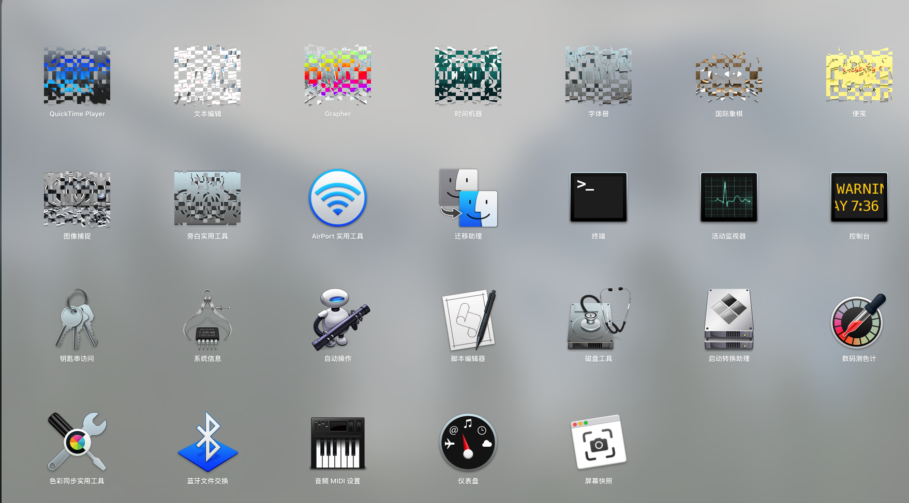
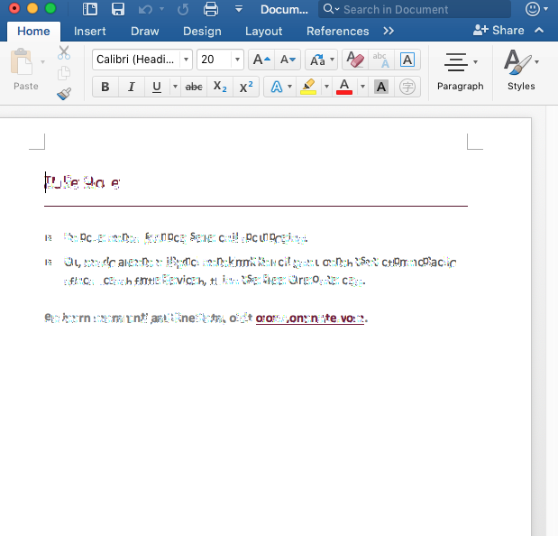
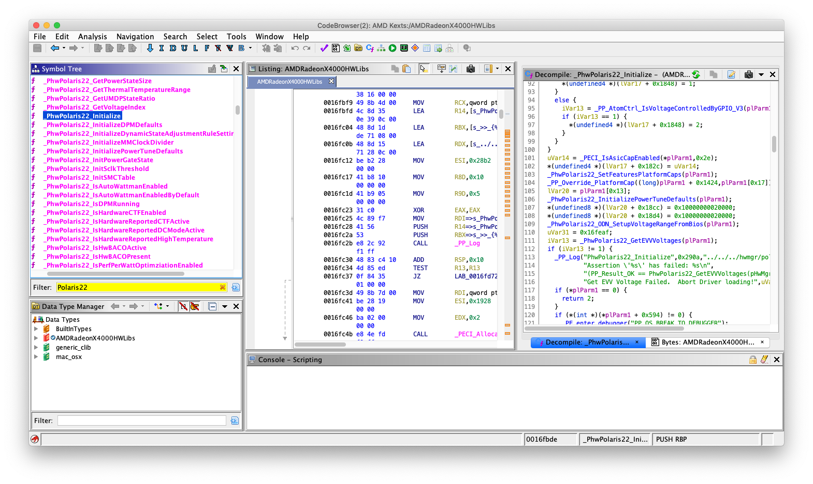
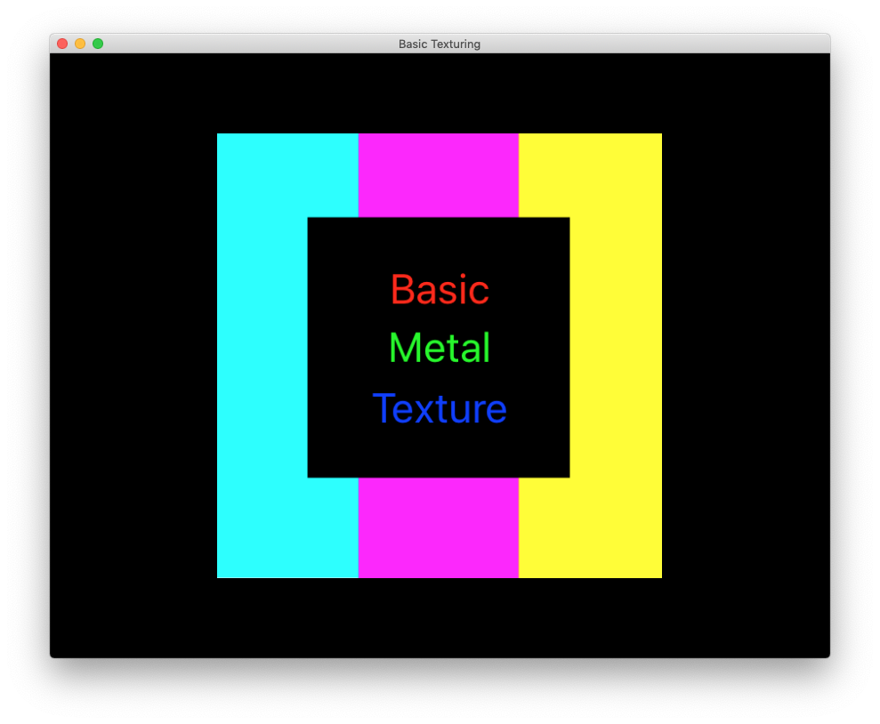
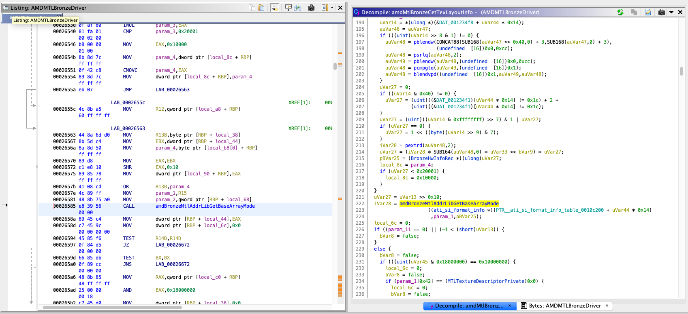

# Metal Driver Fix

We spoof the card's id to one from the Baffin \(Polaris 10\) family because it had the closest architectural similarities to Vega M \(Polaris 22\). This mostly works and gives us graphics acceleration but not without some issues. The biggest issue to resolve is that any Metal app \(including WindowServer\) shows graphical artifacts. Some examples of this can be found in [this thread](https://www.tonymacx86.com/threads/intel-hades-canyon-nuc.250600/).





It makes many apps \(including Safari and the menu bar\) unusable. The problem is in `AMDMTLBronzeDriver.bundle`, the Metal driver. It took a week of reverse engineering the AMD drivers and reading the open source AMD implementation in Linux and Mesa3D to figure the issue out.

### Finding Suspects

The first thing to try is to find the Linux patch for Vega M and see what kernel changes are required. The full 32 patch set can be found in [this mailing list](https://lists.freedesktop.org/archives/amd-gfx/2018-April/021812.html). As you can see, the changes were relevately trivial extension of the Polaris 11/12 code. This explains why the Baffin drivers mostly work as-is on OSX. The biggest changes are the micro-code firmware for Polaris 22 as well as some "golden register settings" \(hardware initialize sequence\). Fortunately, Apple actually includes the microcode and hardware initialization for Polaris 22 even though they don't support it in the higher-level APIs!



Tracing through this code, we find that all the proper micro-code are loaded. The low level services for SMC, ME, SDMA, etc are all implemented. This is great news because it means that 90% of the real "work" is done for us and is the reason why it "almost works" \(because I doubt that you can even boot up if you try to load the Baffin microcode on a Vega M\). Since the HAL drivers should already have Polaris 22 support, the next obivous suspect is the graphics API. On Linux, it's hardware accelerated OpenGL and on OSX it is Metal. For OpenGL, the code can be found in [Mesa3D](https://www.mesa3d.org) under `src/amd` and for Metal, it is in `AMDMTLBronzeDriver.bundle` \(which is a userland driver\). We can do a search for "polaris 22" and "vega m" in the codebase and find a few references in Mesa. 

```c
BOOL_32 CiLib::HwlInitGlobalParams(
    const ADDR_CREATE_INPUT* pCreateIn) ///< [in] create input
{
...
    else if (m_settings.isVegaM)
    {
        m_pipes = 16;
    }
...
}
```

```c
/**
****************************************************************************************************
*   SiLib::ComputePipeFromCoord
*
*   @brief
*       Compute pipe number from coordinates
*   @return
*       Pipe number
****************************************************************************************************
*/
UINT_32 SiLib::ComputePipeFromCoord(
    UINT_32         x,              ///< [in] x coordinate
    UINT_32         y,              ///< [in] y coordinate
    UINT_32         slice,          ///< [in] slice index
    AddrTileMode    tileMode,       ///< [in] tile mode
    UINT_32         pipeSwizzle,    ///< [in] pipe swizzle
    BOOL_32         ignoreSE,       ///< [in] TRUE if shader engines are ignored
    ADDR_TILEINFO*  pTileInfo       ///< [in] Tile info
    ) const
{
...
    if (m_settings.isVegaM && (numPipes == 16))
    {
        UINT_32 pipeMsb = pipeBit0;
        pipeBit0 = pipeBit1;
        pipeBit1 = pipeBit2;
        pipeBit2 = pipeBit3;
        pipeBit3 = pipeMsb;
    } 
...
}
```

```c
/**
****************************************************************************************************
*   SiLib::ComputePipeFromCoord
*
*   @brief
*       Compute pipe number from coordinates
*   @return
*       Pipe number
****************************************************************************************************
*/
UINT_32 SiLib::ComputePipeFromCoord(
    UINT_32         x,              ///< [in] x coordinate
    UINT_32         y,              ///< [in] y coordinate
    UINT_32         slice,          ///< [in] slice index
    AddrTileMode    tileMode,       ///< [in] tile mode
    UINT_32         pipeSwizzle,    ///< [in] pipe swizzle
    BOOL_32         ignoreSE,       ///< [in] TRUE if shader engines are ignored
    ADDR_TILEINFO*  pTileInfo       ///< [in] Tile info
    ) const
{
...
    if (m_settings.isVegaM && (numPipes == 16))
    {
        UINT_32 pipeMsb = pipeBit0;
        pipeBit0 = pipeBit1;
        pipeBit1 = pipeBit2;
        pipeBit2 = pipeBit3;
        pipeBit3 = pipeMsb;
    }
...
}
```

The names sound promising because issues with "tiling" definitely corrosponds with the observed behaviour. Search for these function names actually gets us a hit in `AMDMTLBronzeDriver.bundle`! But it turns out to be false hope because even though addrlib is included in Apple's drivers \(multiple times actually; it's found in the OpenGL drivers and the graphics accelerator kext as well\), it seems to be vestigial code that's never called. It's likely that addrlib is used previously at some point but was later parts were replaced by a closed-source implementation.

### Texture Issues

At this point, it's time to try something else. Static analysis only goes so far, let's try some debugging. First we need a minimum working example to reproduce the error. Fortunally, Apple provides it to us with [this Metal texture rendering sample code](https://developer.apple.com/documentation/metal/creating_and_sampling_textures?language=objc). This piece of code draws a simple quad and maps a basic image to it. Here's how it is supposed to look:



If we run this on our Vega M system though, we get something different.


So something is causing the texture to be intrepreted incorrectly by the GPU. After lots of trial and error setting up breakpoints in different places that have the name "texture" and "tiling" which also interacts with hardware-specific data \(like references to VI/SI/CI or handles data returned from the accelerator kext that is device unique\), one function turned out to be the culprit.



`amdBronzeMtlAddrLibGetBaseArrayMode` takes as parameters: some blob of pre-computed data, a texture description, and a pointer of hardware configuration \(which turns out to be unused\). It returns a `AddrTileMode` that is passed to some addrlib functions. For the sample code, the function returns `ADDR_TM_2D_TILED_THIN1` but if we change it to `ADDR_TM_1D_TILED_THIN1` then the textured square renders correctly! This likely is somehow related to what we found before about the pipe configuration being different in Vega M. Somehow, the pre-computed blob doesn't take account of the Vega M's configuration and `amdBronzeMtlAddrLibGetBaseArrayMode` produces the wrong result. There is likely a deeper reason, but a patch to always return `ADDR_TM_1D_TILED_THIN1` when it would have returned `ADDR_TM_2D_TILED_THIN1` seems to fix all observable issues.

