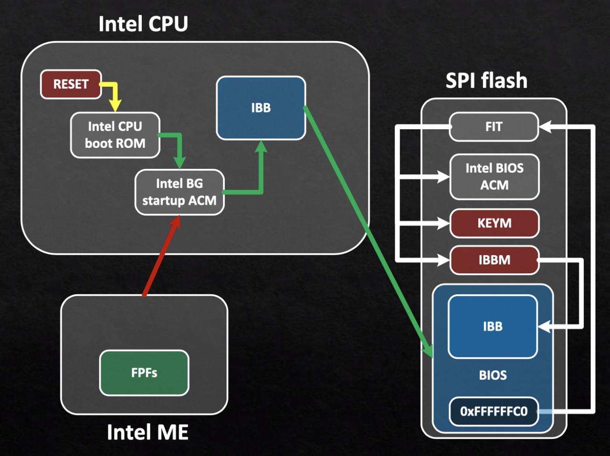
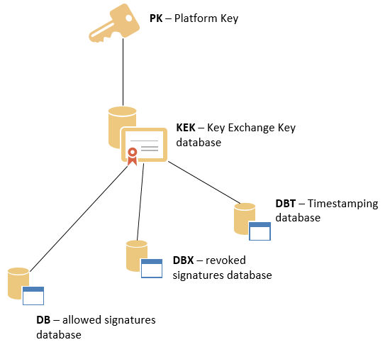

# Secure Boot

Let's be honest: most x86 systems are garbage when platform security is concerned. Intel [does not have the best track record](https://en.wikipedia.org/wiki/Intel_Management_Engine#Security_vulnerabilities) with building secure chips and AMD [doesn't do much better](https://en.wikipedia.org/wiki/AMD_Platform_Security_Processor#Security_history). That's why Apple has recently been improving their boot and platform security with the [T2 chip](https://www.apple.com/mac/docs/Apple_T2_Security_Chip_Overview.pdf). The common belief is that Hackintoshes cannot be as secure as a Mac due to various patches and that it is miles behind a Mac with T2. But how true is that belief?

In this article, we will explore the boot and platform security of Intel x86, the Hades Canyon NUC, and Macs. We will compare the security offerings on these similar platforms and present an argument that we can make the Hades Canyon Hackintosh as secure as most Macs.

### Threat Model

Before starting, it is important to clarify what part of the security architecture is being discussed here. Specifically, we mainly focus on boot-time security from remote attackers. Specifically, we wish to protect against an attack where a compromised OS \(OSX/Windows/Linux\) installs a "bootkit" that persists across a reboot and across a fresh re-install \(with a wiped disk\). We do not consider the security of OSX vs Windows. Finally, we do not consider the security of a local attacker with physical access to the device. Note that the T2 _does_ attempt to protect against local attackers, but this is a much more niche issue.

## Intel Boot Guard

The first link in the secure boot chain is owned solely by Intel on every motherboard with an Intel chipset. When your computer first powers up, two chips are started in parallel. The Intel CPU starts booting from its internal boot ROM which is coded to fetch the Authenticated Code Module \(the first stage bootloader\) from the SPI flash chip. The ACM is signed with an Intel owned key and the public key to verify the signature is inside the boot ROM. At this point, every system has the same security: the ACM is owned by Intel and the signature check \(as far as the public knows\) cannot be disabled. Note that any vulnerability in the boot ROM or ACM can be used to exploit every Intel system out there including all Macs \(including T2 Macs\).

At the same time the PCH \(chipset\) is also booted up and the Intel Media Engine is booted from the ME boot ROM. The ME boot ROM loads the ME firmware from the SPI flash chip and the signature is checked against a public key whose hash is burned into fuses at factory. The key can be owned by either Intel or the OEM \(in the case of NUC, the OEM is also Intel\). Some OEMs \(such as Gigabyte\) have been known to disable the signature checks and therefore have zero platform security.

The ME is the most important part of x86 security because not only does it have full DRAM access, it also feeds the OEM public key and security policies to the CPU. The CPU \(at this point executing the ACM still\) will load the next stage called the Initial Boot Block from the SPI flash. The ACM code then will check the signature of the IBB against the OEM public key from the ME _only if enabled_. Note that many/most OEMs do not enable this and therefore **ANY** IBB can run if flashed into the SPI flash. On the Hades Canyon, only an Intel signed IBB can be executed \(and this cannot be disabled\). On T2 Macs, Apple does additional verification of the IBB and won't even attempt to feed it to the Intel CPU if it fails. Although there is a dearth of details in Apple's whitepaper, presumably this allows for previous IBB to be revoked while on Intel-only systems like the NUC any vulnerable IBB can be downgraded to by an attacker with physical SPI access.

This whole process is referred to as Intel Boot Guard by Intel and is only found on relatively recent \(Haswell+\) systems. There is also an adjacent technology called Intel BIOS Guard which can prevent unauthorized BIOS updates from being flashed if Boot Guard is disabled. In systems with Boot Guard is enabled, BIOS Guard can also be used to prevent downgrades to an vulnerable IBB. However, this is strictly worse than T2 because BIOS Guard requires the integrity of the boot chain up until the OS is booted while the T2 can assume that everything down to the IBB is compromised. The Hades Canyon has both Boot Guard and BIOS Guard enabled, which, from a non-scientific survey of Google search results seems to be quite rare.

This is a very high-level overview of the first part of the boot chain. Primary references used for this section are as followed:

* [Bypassing Intel Boot Guard](https://embedi.org/blog/bypassing-intel-boot-guard/)
* [Safeguarding rootkits: Intel BIOS Guard part 2](https://github.com/flothrone/bootguard/blob/master/Intel%20BG%20part2.pdf)
* [Betraying the BIOS](https://github.com/REhints/BlackHat_2017/blob/master/Betraying%20the%20BIOS.pdf)

## UEFI Security

The IBB is also the start of the UEFI firmware on UEFI systems \(such as the Hades Canyon\). Specifically, it is the Security \(SEC\) Phase and the Pre EFI Initalization \(PEI\) Phase. The IBB is \(if enabled by the OEM\) verified by the ACM with the OEM key passed from the ME. If that mess of acronym soup is nonsense, the section above attempts to explain it in more detail.

The SEC phase sets up some security policies and the PEI phase does the initial setup to bring the Intel CPU to a usable state. The Driver Execution Environment \(DXE\) phase is loaded from the SPI flash which sets up many more devices and brings the computer to a usable state. At this point, the display turns on and you see the OEM logo. More details can be found in the [PI Boot Flow](https://github.com/tianocore/tianocore.github.io/wiki/PI-Boot-Flow) wiki page.

The PEI modules checks the signatures of the DXE modules \(_if such security is even enabled_\). Most "BIOS" vulnerability we know of are in this phase. The latest NUC Hades Canyon BIOS is free of known vulnerabilities and configuration issues. You can check your system with the [chipsec framework](https://github.com/chipsec/chipsec).

The DXE modules sets up the boot device \(NVMe for example\) and then loads the boot manager from the selected boot device. This is usually `/EFI/BOOT/BOOTx64.efi`. When Secure Boot is enabled from the BIOS, the `.efi` must either contain a signature verified from a public key in the platform DB or the hash of the `.efi` itself is in the platform DB.

The DB is a database of allowed public keys and hashes stored in the SPI flash. Along with the DBX \(database of revoked keys/hashes\) and the DBT \(database of timestamps when the keys are valid\), the databases themselves are signed with a key inside the KEK \(Key Exchange Key\) database \(also in the SPI flash\). Finally, the KEK is signed with the Platform Key. All this is explained in more detail in [Diving into Secure Boot](https://blogs.technet.microsoft.com/dubaisec/2016/03/14/diving-into-secure-boot/).

Why do we need this chain of certificates? The reason is ownership of the private keys in each step is different. The PK private key is owned by the owner of the system. This is either you, the end user, or the administrator if the computer belongs to an organization. The PK public key is used to verify the KEK. The KEK private keys are owned by the OS provider. For example, if the administrator wishes to permit Windows 10 to be booted on the computer, she shall put Microsoft's certificate into the KEK. Microsoft will then use their private key to sign all the different valid versions of the Windows Boot Manager, which are then placed into the DB.

Let's talk about the PK, the root key for UEFI Secure Boot. Because it is owned by the system administrator/end user, it is important that an attacker does not overwrite the system's PK or they can bypass the Secure Boot policy. The PK is stored in the NVRAM \(which is usually in the same SPI chip as the BIOS\) as a special variable. Write access to this UEFI variable is permitted only in "user present" context. In Hades Canyon NUC, there are two ways to change the PK: you can reset the PK with the BIOS security jumper inside the case and you can set the PK inside the Visual BIOS program by pressing F2 during boot. Access restriction to the PK variable \(and the Secure Boot enable BIOS option\) is done by the UEFI firmware meaning that \(barring a software vulnerability\), you cannot change the PK from Windows/Linux/OSX.

Note that on Macs \(including T2 Macs\), the usage of PK/KEK/etc are disabled. There is an option to enable "secure boot" on T2 Macs which only checks Microsoft's certificates, but there is no way to add any other certificate or change the "PK" \(which does not exist as Microsoft's certificate is essentially the root key\). There is no way to have a "personalized" secure boot. You either trust only Apple & Microsoft or you trust everyone.

## OpenCore

All of this so far applies to every x86 platform. Now, we will discuss security specific to Hackintoshes. [OpenCore](https://github.com/acidanthera/OpenCorePkg) is a new bootloader designed to run OSX on non-Apple hardware. In addition to being better designed and better coded than Clover, the legacy UEFI bootloader for Hackintoshes, OpenCore introduces security options to the boot process.

In order to boot OSX on a variety of x86 hardware, OpenCore provides an interface to patch ACPI tables, kernel memory, inject additional OSX drivers/kexts, load additional UEFI DXE modules, and more. Now, OSX with System Integrity Protection \(SIP\) enabled protects the system from unauthorized modifications, but OpenCore is outside of SIP's control \(and needs to bypass SIP to make modifications\). An attacker who takes over OSX will usually have a hard time gaining persistence due to SIP, but if they discover the computer is a Hackintosh, they can just use OpenCore as a conduit for boot-persistance.

To counteract this, OpenCore provides an optional feature called the "vault" which allows you to sign a hash of every file OpenCore uses \(all the patches, configuration, injected drivers, etc\) and then embed the public key into the OpenCore EFI binary itself. OpenCore will then check the integrity of all the files on boot. Currently, OpenCore does not check the integrity of Apple's boot.efi for loading XNU, but I believe that is a future addition.

The administrator can then use their custom PK to sign a KEK to sign OpenCore and place the OpenCore certificate inside the DB. With Secure Boot enabled, we can then complete the chain of trust by loaded a verified OpenCore \(whose binary contains the vault public key\) which verifies all the items in the vault before booting into a SIP enabled OSX.

## Summary

This is how the final chain of trust looks for the Hades Canyon running OpenCore with UEFI Secure Boot enabled:

1. Intel ME boot ROM is implicitly trusted as the root.
2. ME ROM with proper fuses blown verifies ME firmware with Intel's key
3. ME firmware passes security policy and OEM key to Intel CPU
4. CPU boot ROM is implicitly trusted and it verifies the ACM with Intel's key
5. ACM verifies IBB with OEM key from ME firmware
6. IBB verifies UEFI DXE with OEM key
7. The KEK is verified with the PK \(owned by the administrator\)
8. A certificate in KEK verifies the DB
9. A certificate in the DB verifies the OpenCore binary
10. OpenCore verifies the vault files with its embedded public key
11. OSX boots with SIP enabled and all binaries fall under Apple's signing policies

How does this compare to a T2 Mac? The main difference is that with the lack of the PK, there is no way for a local attacker to compromise chain from that point. The second difference is that the T2's policy checks could allow for downgrade protection against a SPI re-flash attack. The third difference is that the chain of trust is shorter for Apple because they trust less 3rd parties \(OEM + system administrator\), and therefore there is less room for mistakes. It is also important to point out that OpenCore + third party plugins and extensions are more likely to have security bugs as there has been less security research into those components compared to parts shared by Macs and other x86 platforms.

How does the Hades Canyon compare to other systems? It is still rare for Intel BIOS Guard and Intel Boot Guard to be enabled, and without those two the chain breaks very early on and the rest is not worth considering. You can check the status of your platform security using [chipsec](https://github.com/chipsec/chipsec) to see if the security features are enabled and configured properly.

