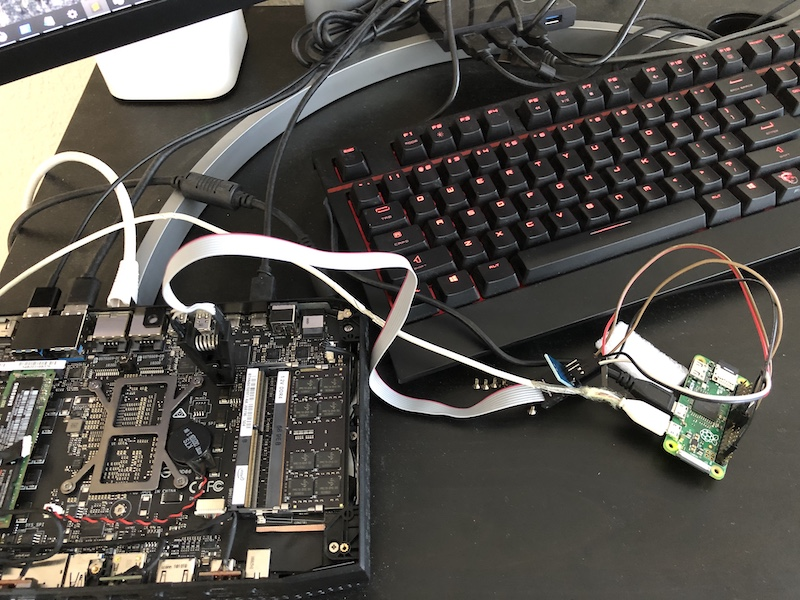
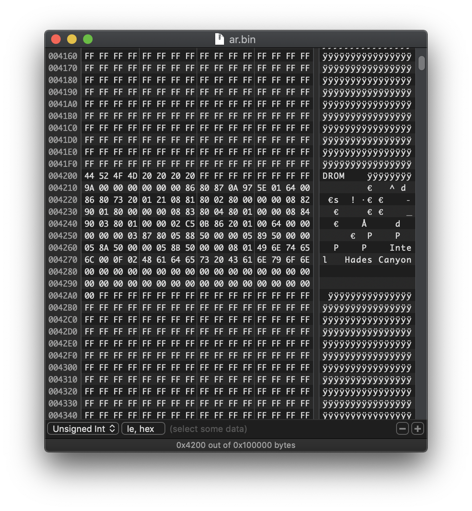
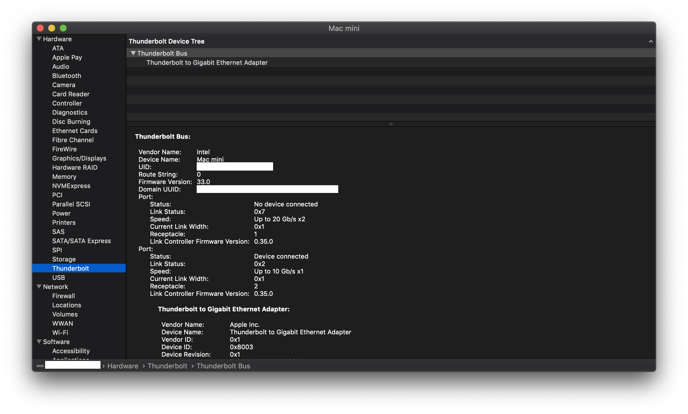

# Thunderbolt 3 Fix \(Part 3\)

In the Sisyphean task of creating a Hackintosh with perfect compatibility, getting Thunderbolt to work has been a struggle. In the [first part](thunderbolt-3-fix.md) of the series, we presented the "simple" solution: make OSX treat the Thunderbolt bridge as a dumb PCIe bridge. While this worked well enough, the incompatible way that OSX handles power management with the way the Intel board was designed to handle power management created a lot of issues that usually resulted in a kernel panic. Additionally, without the native Thunderbolt driver working, there is always incompatibilities with devices that expect to interface directly with the OS \(including most Apple first and second party hardware\).

In [part two](thunderbolt-3-fix-part-2.md), we presented a "hybrid" solution: we force the controller itself to restart and then we disable the built-in Connection Manager firmware so that OSX can act as an external Connection Manager. This worked enough to get the Thunderbolt driver to recognize the controller and we were able to enumerate devices and interface with them. However, after a week of usage, it appears that the "solution" was a band-aid at best. There was a litany of issues mostly with bootup and wakeup. Essentially, we were putting the Alpine Ridge into a state that was never tested by the engineers who designed it and therefore we uncovered tonnes of software and hardware bugs that the team at Intel never expected people to find.

It became clear that the only way to get Thunderbolt working without all these edge-case issues is to put the Alpine Ridge into a state that is well-tested. That is, we have to flash Apple's controller firmware onto our own controller.

### Escape Route

Flashing firmwares is a dangerous game. Any mistake would lock us out as the on-device flashing mechanism would be disabled due to a bad flash or bad firmware. To prepare for this inevitable situation, we need to have an external dumper handy. A [SPI flash clip](http://dangerousprototypes.com/docs/Flashing_a_BIOS_chip_with_Bus_Pirate#Standard_SOIC8_clip) \(usually designed for BIOS flashing\) does the work here. We hook it to the closest SPI chip \(identified by the model number etched on the chip\) to the Alpine Ridge and dump the contents.

### NUC Firmware

First, let's get the latest Thunderbolt firmware [from Intel](https://downloadcenter.intel.com/download/28525/Thunderbolt-3-Controller-Firmware-Update-Tool-for-NUC8i7HNK-NUC8i7HVK?product=126143). The filename `Intel_Hades_AR_HR_4C_C0_rev33_W_TI_20180109_SEC1_sign.bin` indicates that the firmware is signed. I can confirm that the name is not a lie, because any modification of the file will result in the firmware update failing. Even if you force the firmware to be flashed via an external flasher, the next boot will see the controller in "safe mode" and it will refuse to enumerate any PCIe device unless the firmware is updated. At offset `0x39010` is an RSA public key and at offset `0x3A010` is a signature. Both the public key and the signature are stored in raw little endian bytes. After converting it to big endian, the signature decrypts successfully with the public key and it is a PKCS\#1 encoded signature.

If you're thinking "hey wait a minute, the public key is stored in the same file and there's no certificate," I'll save you the trouble. After replacing the public key with my own and then re-signing the same PKCS\#1 data with that key and flashing it using the external flasher, I observe the same behaviour as when the signature was broken \(controller enters safe mode\). There is likely a hash of the public key burned in to the silicon in fuses or something.

### Mac Firmware

The firmware for all Macs are found in the OSX installer inside `Packages/FirmwareUpdate.pkg`. Using `pkgutil --expand-full`, we can dump the package and we find `Script/Tools/USBCUpdater` where there is a sub-directory for each Mac's board id along with `ThorUtil.efi`, the firmware update utility. No, [it's not a secret EFI malware no matter what the FBI says](https://github.com/rickmark/mojo_thor/tree/a3e9e6d8d75e90c06714391110a33180467ded5e). `Mac-BE088AF8C5EB4FA2` is a good choice because it has the same Alpine Ridge controller and the system itself is also Kabylake. `Mac-BE088AF8C5EB4FA2-C0_5.56.0-C0_33.1.bin` from the 10.14 installer has the closest firmware version to the v33 one from Intel.

As expected, trying to flash the iMac's firmware onto the NUC was rejected by Intel's updater because of the incorrect public key \(Apple uses a different key\). In safe mode, you can bypass such checks and force the firmware to be flashed. This is a bad idea. Even though a bad Ridge firmware will end up in safe mode where you can attempt to flash another firmware, the .bin also contains the TI power controller firmware. The power controller manages the reset signal to the Ridge and once that is bricked, the Ridge will not even turn on, much less enter safe mode. Thankfully, we can use our escape route to recover the bad flash. If we look near the end of the update .bin, we see that the Mac's firmware has the string `TPS65983 HW FW0005.56.00 ZACE2D3` while the NUC's firmware has the string `TPS65982 HW FW0001.12.06 ZTBT1`. They are different hardware!

### Firmware analysis

By doing a binary diff on the two files, we make a few interesting observations.

1. There are relatively few difference until `0x3B010`. This is where the TI firmware resides in the NUC's binary. The TI firmware is at `0x6A000` in the Mac's binary. Note that TI's [firmware update manual](http://www.ti.com/lit/pdf/slva783) says that at offset `0xFFC`, there is a pointer to the start of the firmware and this matches up.
2. Because we find a few bits changed here and there, we can conclude the firmware is NOT encrypted. It does appear to be compressed though but running it through all standard decompression algorithms yielded no results. We suspect that, like the [Intel ME](http://blog.ptsecurity.com/2017/12/huffman-tables-intel-me.html), a custom compression scheme is used.
3. At offset `0x0`, we find a pointer to the start of the firmware at `0x4000`. However, after flashing it through the updater and dumping the SPI, we see that `0xFFFFFFFF` sometimes gets written to `0x0` instead and `0x4000` is written to `0x1000`. It appears that the notion of an active/inactive region from the [TI manual](http://www.ti.com/lit/pdf/slva783) applies to the Alpine Ridge as well. We can deduce that the update process will load the image to the inactive region, then swap the pointers if validation succeeds.

### Patching

After splicing the NUC's TI firmware into the iMac's update file and flashing it in safe mode, it works as expected! In OSX, the controller boots up with ICM disabled and the Thunderbolt driver takes over as the CM. Sleep/wake works. Hotplug works. Everything seems great. There are a few issues though \(because why would you expect otherwise\). If you quickly switch a TB device and a USB device, it will freeze up the whole system. This appears to be a hardware bug and there's nothing we can do about it. The run-time power savings are disabled as the GPIO signals that control them appear to be hard wired high \(because they were not used in the ICM controlled environment\). Then, of course the biggest issue is that in Windows, because of the signature check fail, it will always be in safe mode and would not enumerate devices \(but USB still works\).

The next step is to create a live-patcher so we do not have to depend on Intel's firmware updater on Windows or Linux to update. Instead of reversing Intel's update protocol, we instead just implement TI's update protocol, which is [well documented](http://www.ti.com/lit/pdf/slva783). The two share a single SPI chip so we can use TI's I2C interface to write to the shared SPI memory. An additional advantage of this is that even if we brick the Ridge, we can always recover though the TI controller \(as long as we make sure never to touch TI's firmware\). The patcher utility can be [found here](https://github.com/osy/ThunderboltPatcher). It requires some [secret](https://github.com/osy/HaC-Mini/blob/e3c95882e72f4e93585017909fc3824d04260188/OC/config.plist#L231-L240) [sauce](https://github.com/osy/HaC-Mini/blob/e3c95882e72f4e93585017909fc3824d04260188/ACPI/SSDT-Hpm.asl) to get the OSX drivers to recognize the TI controller. In the end, we only needed to patch [9 locations](https://github.com/osy/ThunderboltPatcher/blob/master/Patches/NUC_Hades_Canyon_Apple_Mode.plist).

### Comparison

Here is the final score sheet for the three attempted fixes.

|  | Legacy | Hybrid | Native |
| :--- | :--- | :--- | :--- |
| Bootup with TB | Yes \(1\) | Yes \(1\) | Yes |
| Bootup with USB | Yes | Yes | Yes |
| Hotplug USB | Yes \(1\) | Yes \(1\) | Yes |
| Hotplug TB | Yes | Yes | Yes |
| CIO Device | No | Yes | Yes |
| PCIE Device | Yes | Yes | Yes |
| USB Device | Yes | Yes | Yes |
| RTD3 \(Save Power\) | No | Yes | No |
| Sleep | Yes | Yes \(2\) | Yes |
| Wakeup | Yes \(1,3\) | Yes \(1\) | Yes |
| Windows: USB | Yes | Yes | Yes |
| Windows: TB | Yes | Yes | No \(4\) |

\(1\) If booted up or woken up with a TB device and NO USB device, then the XHCI controller will not be powered up and USB 3.0 will not work until next reboot.

\(2\) Sleep works 50% of the time. Due to LC quirks, device will insta-wake half the time. However, OSX will try again and again until it succeeds.

\(3\) If woken up without any device attached, &lt; 25% chance of kernel panic as the LC does not become ready fast enough.

\(4\) If the LC already set up a PCIE device \(in OSX\) and then warm-reboot into Windows, that device will still be available.

In summary, for maximum compatibility with Windows, use the legacy method and disable sleep. Otherwise, if OSX is your main OS, the native method is recommended.

