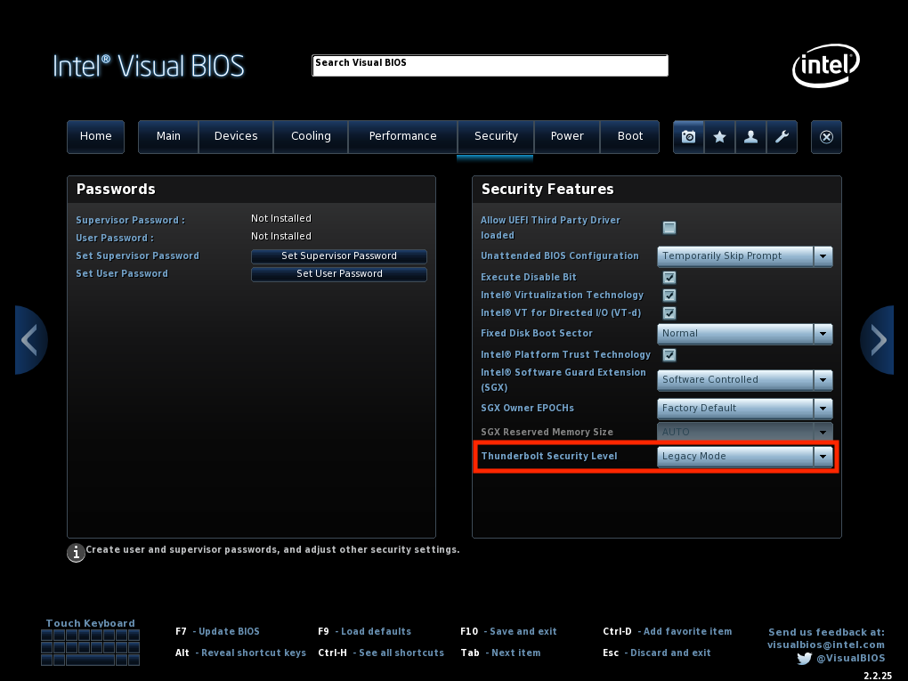
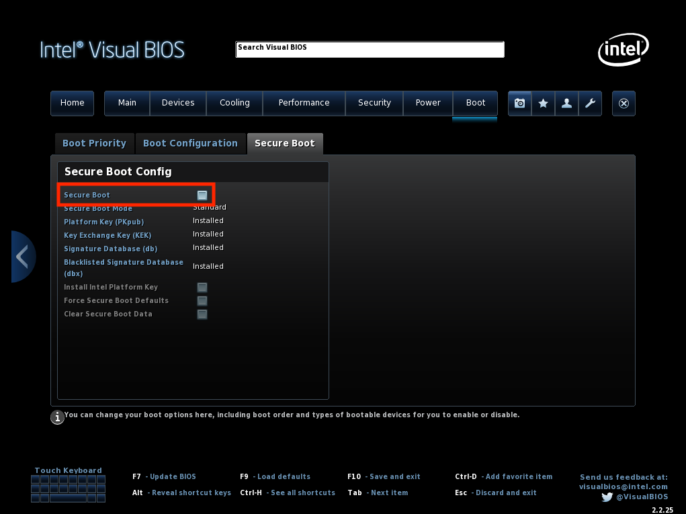

# BIOS Settings

First, make sure your BIOS is up-to-date. You can find the [latest BIOS here](https://downloadcenter.intel.com/product/126143). At the time of writing, the latest version is **HN0058** so make sure your BIOS is at least that version.

It is important to reset your BIOS settings to the defaults. After everything is working, you can come back and tweak any overclock settings. After resetting the BIOS settings, we make three changes:

