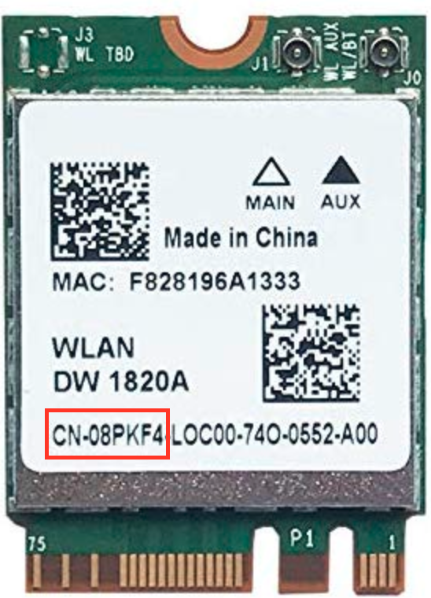

# DW1820A Wifi

Although using a Wifi card from a real Mac is [recommended](wifi.md) due to native support, the community has developed an [alternative](https://github.com/osy86/HaC-Mini/issues/91) [solution](https://github.com/osy86/HaC-Mini/issues/113) to working Wifi and Bluetooth using the Dell DW1820A card. Note there are a few variants of this card and users have reported the most success with the "CN-08PKF4" model.

This card requires additional kernel patches to work and users have reported compatibility issues with dual booting. However, it is the same size as the stock Intel card \(which is NOT supported by any drivers\) and installation is fairly straightforward.

### Installation

1. In BIOS, under Power, disable PCIE ASPM
2. In the NuC Mini installer, make sure to check the option for **Dell DW1820A**.

