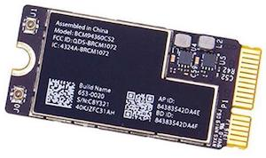
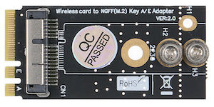
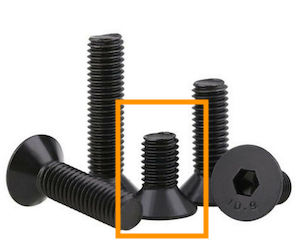
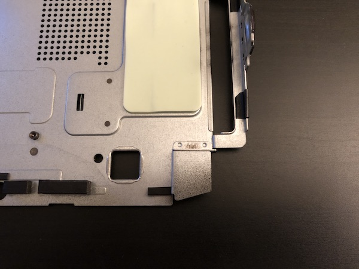
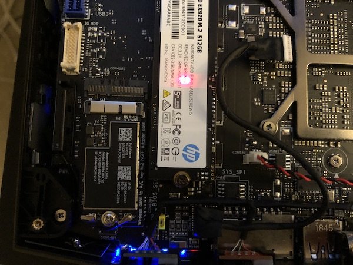

# Replacing Wifi Card

A problem shared by most Hackintosh builds is that OSX's Wifi/BT drivers are limited to a handful of Apple Broadcom cards. For builds with removable Wifi cards, the best option is to replace it with an authentic Apple part. This requires an adapter and on the Hades Canyon NUC it also requires a small case mod to get the card to fit.

With the Wifi card replaced, you can get continuity/handoff features \(and Apple Watch unlocking\) without any unstable software hacks.

For an easier \(but less perfect\) solution that will not block the second M.2 NVMe slot, check out the [DW1820A](dw1820a-wifi.md). There is also [another adapter](https://github.com/osy/HaC-Mini/issues/191) for Apple BCM943602CS that will allow you to retain the second M.2 NVMe slot but will require re-wiring the antennas.

### Requirements

You need the **BCM94360CS2** Wifi/BT module. It comes from the 2013 MacBook Air line and supports BT4.0 and 802.11a/g/n/ac \(2.4GHz/5GHz\). You can find it pretty cheap on eBay for &lt; $10 USD.

You also need a **M.2 NGFF adapter** to connect it to the NUC. You can find this by searching for "BCM94360CS2 m2 adapter" on eBay. It also costs &lt; $10.

Optionally, you may want to get **M3x4 mm countersunk screws**. They will help you secure the adapter card to the system. Search for them on eBay.

### Case Mod

Because the adapter is much taller than the Intel Wifi card, you need to modify the metal frame to support it. Once you remove the metal frame and flip it over you will see that a tab indents into the space that is now taken up by the adapter card. If you are unsure of where it is, just install the adapter and try to put the top frame back on \(softly\) and you should see that one of the corner will not fit on.

Removing this part is pretty simple. The tab is actually composed of two parts: the part on the top is attached to the frame while the part on the bottom is part of the frame bent inwards.

Remove the bottom part first by slowly bending the metal back and forth. We abuse the ductility of the metal by putting a lot of stress on the existing bend. By bending it forwards and backwards many times, the tab should come off on its own.


Be careful not to warp the rest of the frame. Keep one hand firm on the frame close to the bend so when you apply force with the other hand, you do not bend the entire frame but just the tab.


The top part comes off easily with a pair of priers. Just jiggle it a little with your priers. You should apply a little force but not too much to risk warping the frame.

### Installation

The adapter card is much taller than a typical M.2 Wifi card so you'll lose access to the left M.2 NVMe slot. To remove the screw holding the Wifi card in place, you need a small wrench or a 5mm nut driver. If you have a M3x4 screw, use it to secure the adapter to the motherboard. Then put the Apple Wifi card into the adapter and screw it on with the provided screw. Finally, attach both Wifi antannas. You can keep the card in place by the tension of the antannas and the pressure of the top lid.

